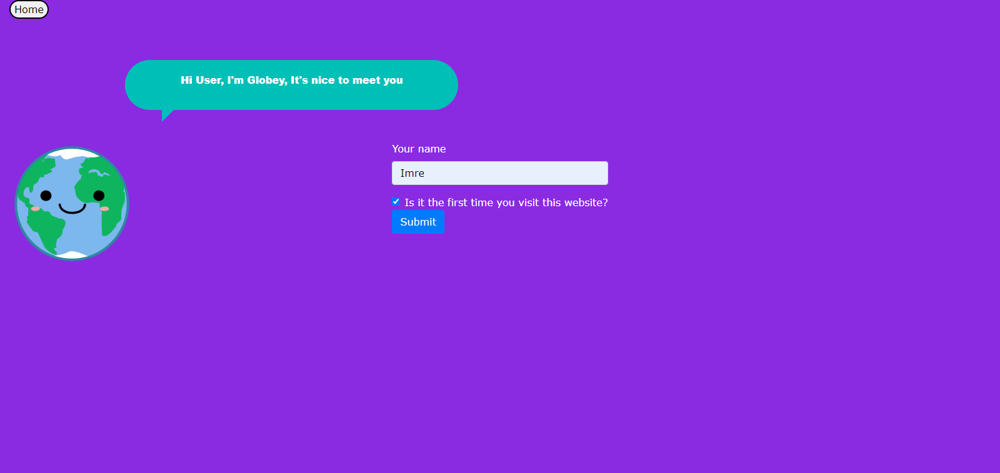
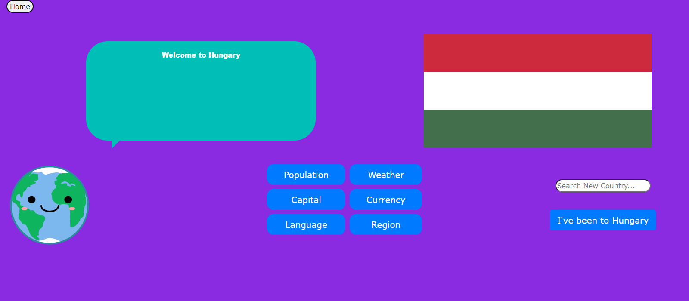
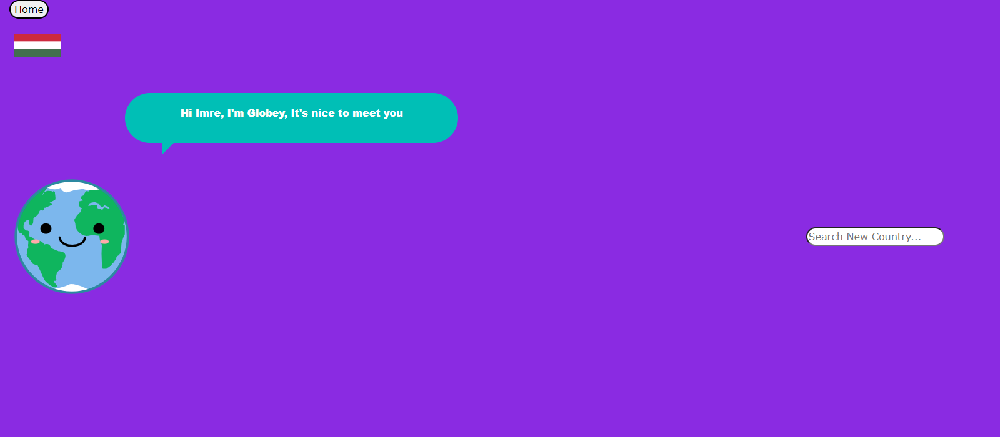

# Globey

## Description

This is the first group project for the edX Skills for Life Front-End Web Development Bootcamp. The application is aim to serve educational purposes as it provides information about different countries of the world for kids and curious adults.
 

## Usage

The website doesn't require any installation. As a user when you open up the website in the browser you will be presented with the Homepage, where Globey, your guide on your whole journey, welcome you in a speech bubble and you will be asked to enter your name and tick the checkbox if it is the first time you visit the website.
Once you click the "Submit" button you will be redirected to the next screen where if you are a returning visitor can see the countries' flags that you already visited on the top left corner. On the right hand side you can find the Search field to search for a new country and once you hit enter you will be redirected to the next screen where you will be welcomed in the selected country by Globey and you will have the options to select the information that you want to know more about (e.g.: population, current weather, capital city, main currency, main spoken language and the region where the country lies) and you will also be able to see the flag of the selected country. Once you have got all the information that you wish to know
about the selected country you can press the button at the bottom right corner which says "I have been to..." and the countries you already visited will be saved into localStorage.
You can also press the "Home" button which will take you back to the Home screen.
 

Please see some mockup images of the website:

On the first image you can see the first screen where you will be asked to enter you name:

 

 
On the second image you will the screen after you searched for a country:
 

 

 
On the third image you will see the screen when a user revisit a page:
 

 

 
You can find the deployed website on the following link: https://jxg052.github.io/Globey/

 
You can find the slides for our presentation here: https://docs.google.com/presentation/d/1UuGefKs7Tfp17llfURmDcTgUMuSgxCFTqMwXYBE9H9g/edit?usp=sharing

## Technologies

HTML, CSS, Javascript, Bootstrap 4, JQuery, Third party APIs (OpenWeatherMap API, REST Countries API), Whimsical for wireframing.
 

## Credits

Lee, Kwok Leung, Imre Vigh, Jon Green.
 

## License

Plese refer to the LICENSE file in the repo.